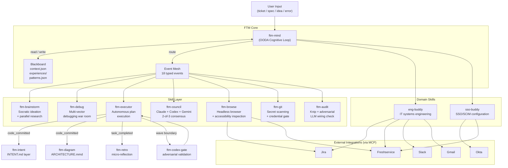

# Feed The Machine

Models get smarter every quarter. Your workflow shouldn't have to start over every time.

FTM is a cognitive architecture for Claude Code — not a prompt library, not a wrapper, not scaffolding that dies on the next model drop. It's a persistent intelligence layer that learns how *you* work and gets better every time you use it. The OODA (Observe, Orient, Decide, Act) reasoning loop, the blackboard memory, the multi-model deliberation, the event mesh — these are design patterns that become *more* valuable as models improve, not less.

Drop in anything. A support ticket, a feature spec, a bug report, a half-formed idea, a meeting transcript, a "figure this out." The machine reads everything, proposes a plan, waits for your approval, then executes end-to-end. Every successful execution becomes a playbook. Every playbook makes the next similar task faster.

This repo also includes **domain-specific skills** — standalone assistants built on the same architecture for IT operations work: SSO configuration, systems engineering, and more.

---

## What's In This Repo

### FTM Core — Cognitive Architecture

The FTM skill ecosystem is a set of 20+ interconnected skills that give Claude Code persistent memory, planning, multi-model reasoning, and autonomous execution.

### Domain Skills — IT Operations

| Skill | What It Does |
|-------|-------------|
| **[eng-buddy](#eng-buddy)** | IT systems engineering assistant — playbooks, session hooks, memory, and templates for managing Jira, Freshservice, Okta, Slack, and cross-team coordination |
| **[sso-buddy](#sso-buddy)** | Interactive SSO/SCIM configuration guide — walks you through each phase of onboarding a new app to SSO, from intake to post-rollout monitoring |

### Shared State

| Directory | What It Contains |
|-----------|-----------------|
| `ftm-state/blackboard/` | Persistent knowledge store — context, experiences, and promoted patterns that compound across sessions |

---

## Plain English

You know how every time you start a new chat with an AI, it has no idea who you are, what you're working on, or what you tried last time? You end up repeating yourself constantly. And when you ask it to do something complex, you have to hold its hand through every single step.

FTM fixes that.

It's a brain upgrade for Claude Code (Anthropic's AI coding tool). You install it once, and from that point on:

- **It remembers.** Not just within one conversation — across all of them. It builds a memory of your projects, your preferences, what worked before, and what didn't. The more you use it, the less you have to explain.

- **It plans before it acts.** You throw a task at it — could be a bug, a feature request, a vague idea, whatever — and instead of immediately doing something dumb, it reads your context, makes a plan, and shows you the plan first. You approve it, tweak it, or tell it to rethink. Then it goes.

- **It does the whole thing, not just one step.** Most AI tools help you write a function or answer a question. FTM coordinates entire workflows — it can read a support ticket, look up the customer's history, draft a response, update the ticket, and notify your team. All from one input.

- **It gets a second opinion.** For hard decisions, it doesn't just trust one AI. It asks Claude, GPT, and Gemini independently, then picks the answer where at least two agree. Like calling three contractors instead of trusting the first quote.

- **It gets better over time.** Every task it completes becomes a playbook. See the same type of bug three times? It already knows the pattern. Similar support ticket? It remembers what worked last time. It's not just a tool — it's a tool that sharpens itself.

Think of it like this: regular AI is a blank whiteboard every time you walk into the room. FTM is an assistant who was in yesterday's meeting, read the doc you shared last week, and already has a draft ready when you walk in.

---

## Why This Exists

Most AI tooling is disposable by design. You write prompts, the model gets better, your prompts become unnecessary. That's the scaffolding thesis — and it's true for most of what people are building.

FTM is built on the opposite bet: **the orchestration layer survives model drops.** Three things in this system are structurally hard for any single model provider to absorb:

**Persistent memory that compounds.** Claude's native memory is conversation-scoped. FTM's blackboard is a three-tier knowledge store — context, experiences, patterns — that persists across every session. By your twentieth task, it knows your stack, your team's conventions, the quirks of your external services, and what kinds of plans you tend to push back on. It's not remembering facts. It's building judgment.

**Multi-model deliberation.** FTM's council sends hard decisions to Claude, Codex, and Gemini as equal peers, then loops through rounds of debate until 2-of-3 agree. No model provider will ever natively ship "ask our competitors for a second opinion." That's permanently outside their incentive structure.

**Event-driven skill composition.** 18 typed events wire skills together automatically — a commit triggers documentation updates and architecture diagrams, a completed task triggers micro-reflection, a wave boundary triggers adversarial validation. This is workflow orchestration that sits above any single model's capability. It's closer to what Temporal does than what a model improvement would replace.

The ideas are portable. The architecture is model-agnostic. The skills format is just the current packaging.

---

## The Loop

Every task, every time:

```
FEED --> PLAN --> APPROVE --> EXECUTE --> LEARN
  ^                                        |
  +------------- (next task) --------------+
```

**FEED** — Paste anything. A ticket URL. A spec doc. An error stack trace. A Slack thread. Plain English. The machine reads it all.

**PLAN** — ftm-mind runs the OODA loop (Observe what you gave it, Orient using blackboard memory, Decide on an approach, Act by assembling the right skills) and proposes a concrete plan with numbered steps.

**APPROVE** — You review the plan. Modify it, ask questions, or just say "go."

**EXECUTE** — Parallel agent teams work through the plan. Each wave completes, validates, and checks in before the next begins. Browser automation, git ops, test runs, API calls — all coordinated.

**LEARN** — Every outcome writes back to the blackboard: what worked, what failed, what pattern to remember. Next time you bring a similar task, the machine already knows the shape of it.

---

## Architecture



---

## FTM Skill Inventory

| Skill | What It Does |
|-------|-------------|
| **ftm-mind** | Observe-Orient-Decide-Act cognitive loop — the universal entry point; reads context, sizes tasks, routes everything |
| **ftm-executor** | Autonomous plan execution with dynamically assembled agent teams and wave-by-wave progress |
| **ftm-debug** | Multi-vector debugging war room — parallel hypothesis testing, static + runtime + dependency analysis |
| **ftm-brainstorm** | Socratic ideation with parallel web and GitHub research agents; challenges assumptions, surfaces options |
| **ftm-researcher** | Deep parallel research engine with domain-specialized finders, adversarial review, and credibility scoring |
| **ftm-audit** | Wiring verification — knip static analysis plus adversarial LLM audit of skill connections |
| **ftm-council** | Multi-model deliberation — Claude, Codex, and Gemini debate to 2-of-3 consensus on hard decisions |
| **ftm-codex-gate** | Adversarial Codex validation at executor wave boundaries before proceeding |
| **ftm-retro** | Post-execution retrospectives and continuous micro-reflections after every task |
| **ftm-intent** | INTENT.md documentation layer — function-level contracts, auto-updated on every commit |
| **ftm-diagram** | ARCHITECTURE.mmd mermaid diagrams — auto-regenerated after commits |
| **ftm-map** | Persistent code knowledge graph — tree-sitter + SQLite FTS5 for blast radius analysis and dependency chains |
| **ftm-browse** | Headless browser — screenshots, accessibility tree inspection, form automation, visual verification |
| **ftm-git** | Secret scanning and credential safety gate for all git operations |
| **ftm-capture** | Extract reusable routines and playbooks from session work into knowledge layers |
| **ftm-routine** | Execute named, recurring multi-step workflows from YAML definitions |
| **ftm-pause** | Save current session state to the blackboard mid-task |
| **ftm-resume** | Restore a paused session and continue exactly where you left off |
| **ftm-dashboard** | Session and weekly analytics — skills invoked, approval rates, patterns promoted |
| **ftm-upgrade** | Self-upgrade from GitHub releases |
| **ftm-config** | Configure model profiles and execution preferences |
| **ftm** | Bare invocation — equivalent to `/ftm-mind` with plain-language input |

---

## Domain Skills

### eng-buddy

Your personal IT systems engineering assistant. Built for managing the chaos of cross-team coordination, ticket triage, and context switching across Jira, Freshservice, Okta, Slack, and Gmail.

**What's included:**

| Component | Purpose |
|-----------|---------|
| `SKILL.md` | Core skill prompt — task organization, meeting analysis, request tracking, context switching |
| `playbooks/` | Reusable operational runbooks — saml2aws troubleshooting, Freshservice catalog config, Google Admin DWD setup |
| `playbooks/tool-registry/` | MCP tool defaults for Jira, Freshservice, Slack, Gmail, Confluence, Playwright |
| `hooks/` | Claude Code hooks — draft enforcement, session management, compaction handling, session snapshots |
| `memory/` | Persistent state — context, patterns, and stakeholder directory |
| `templates/` | Reusable templates — SSO stakeholder communications, timestamp formatting |

**Invoke:** `/eng-buddy`

---

### sso-buddy

Interactive guide for SSO/SCIM configuration. Walks you through the full lifecycle of onboarding a new application to SSO — from gathering requirements to post-rollout monitoring.

**The 8 phases:**

1. **Intake & Documentation** — RBAC sheet, requirements gathering
2. **Administrative Access Setup** — Get admin access to the target app
3. **Identity Provider Configuration** — Okta groups, naming conventions, API setup
4. **Self-Service Provisioning Setup** — SCIM provisioning, attribute mapping
5. **License Management Integration** — Trelica license tracking
6. **Testing & Validation** — Test plans, validation checklists
7. **Communication & Rollout** — Draft emails, user guides, FAQs
8. **Post-Rollout & Monitoring** — Monitor and document lessons learned

Includes the full SSO configuration runbook at `sso-buddy/sso-plan.md`.

**Invoke:** `/sso-buddy`

---

## How It Learns

The blackboard is a three-tier knowledge store that persists across every session:

| Tier | What's Stored | When It's Read |
|------|--------------|----------------|
| `context.json` | Current task, recent decisions, your stated preferences | Every single request |
| `experiences/*.json` | Per-task learnings — one file per completed task, tagged by type | Orient phase, filtered by similarity to current task |
| `patterns.json` | Insights promoted after 3+ confirming experiences — durable heuristics | Orient phase, matched to the current situation |

Cold start is fine. The blackboard bootstraps aggressively in the first ten interactions and reaches useful density fast. By session twenty, FTM knows your stack, your team's conventions, the quirks of your external services, and what kinds of plans you tend to push back on.

Every skill writes back. ftm-executor writes task outcomes. ftm-debug writes what the root cause turned out to be. ftm-retro promotes patterns when it sees the same learning three times. The machine gets better with every task you feed it.

---

## Install & Config

**Quick start:** See [docs/QUICKSTART.md](docs/QUICKSTART.md)

**Configuration reference:** See [docs/CONFIGURATION.md](docs/CONFIGURATION.md)

**Development install:**

```bash
git clone https://github.com/Klaviyo-IT/feed-the-machine.git ~/feed-the-machine
cd ~/feed-the-machine
./install.sh
```

Pull updates anytime: `git pull && ./install.sh`

Remove: `./uninstall.sh` (removes symlinks only, keeps your blackboard data)

**Model profiles** — edit `~/.claude/ftm-config.yml`:

```yaml
profile: balanced    # quality | balanced | budget

profiles:
  balanced:
    planning: opus      # brainstorm, research
    execution: sonnet   # agent task implementation
    review: sonnet      # audit, debug review
```

**Optional dependencies** for the full stack:

- [Codex CLI](https://github.com/openai/codex) — required for `ftm-council` and `ftm-codex-gate`
- [Gemini CLI](https://github.com/google/gemini-cli) — required for `ftm-council`
- Playwright MCP server (`npx @playwright/mcp@latest`) — required for `ftm-browse`
  *(MCP = Model Context Protocol — the standard way AI tools connect to external services)*

All other skills run on Claude Code alone.

---

## License

MIT
