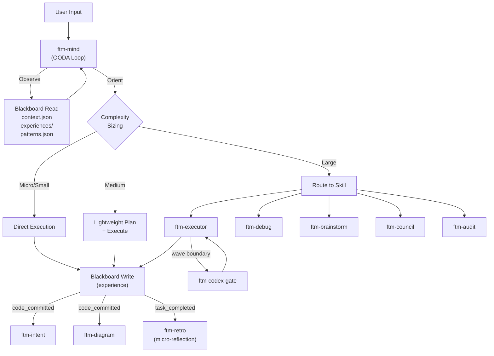

# FTM Skills

A unified intelligence layer for Claude Code. Sixteen skills that give Claude persistent memory, OODA-based reasoning, and autonomous execution — turning one-shot responses into a system that gets smarter with every session.

## Quick Start

```bash
npx ftm-skills@latest
```

Symlinks all skills into `~/.claude/skills/` where Claude Code discovers them automatically.

## Development Install

```bash
git clone https://github.com/kkudumu/ftm-brain.git ~/ftm-brain
cd ~/ftm-brain
./install.sh
```

Pull updates anytime with `git pull && ./install.sh`. To remove: `./uninstall.sh` (removes symlinks only, keeps your data).

## What's Included

| Skill | Description |
|-------|-------------|
| **ftm-mind** | OODA cognitive loop — the default entry point for all freeform input |
| **ftm-executor** | Autonomous plan execution with dynamically assembled agent teams |
| **ftm-debug** | Multi-vector debugging war room with parallel hypothesis testing |
| **ftm-brainstorm** | Socratic ideation with parallel web and GitHub research agents |
| **ftm-audit** | Wiring verification — knip static analysis plus adversarial LLM audit |
| **ftm-council** | Multi-model deliberation — Claude, Codex, and Gemini debate to 2-of-3 consensus |
| **ftm-codex-gate** | Adversarial Codex validation at executor wave boundaries |
| **ftm-retro** | Post-execution retrospectives and continuous micro-reflections |
| **ftm-intent** | INTENT.md documentation layer — function-level contracts, auto-updated |
| **ftm-diagram** | ARCHITECTURE.mmd mermaid diagrams — auto-updated after commits |
| **ftm-browse** | Headless browser — screenshots, ARIA inspection, visual verification |
| **ftm-git** | Secret scanning and credential safety gate for git operations |
| **ftm-pause** | Save current session state to blackboard |
| **ftm-resume** | Restore a paused session and continue where you left off |
| **ftm-upgrade** | Self-upgrade from GitHub releases |
| **ftm-config** | Configure model profiles and execution preferences |

## Architecture



## How It Works

Every request runs through an **Observe → Orient → Decide → Act** loop:

**Observe** — Capture your input, read session state from the blackboard, check git status.

**Orient** — Load memory tiers (current context, past experiences, promoted patterns), scan the 16 available skills, assess codebase reality. This is where the reasoning happens — not keyword matching but contextual judgment.

**Decide** — Size the task (micro / small / medium / large) and pick the smallest correct move. Simple things stay simple. Complex things escalate automatically.

**Act** — Execute directly or route to the right skill, write the outcome back to the blackboard, then loop back to Observe.

### Persistent Memory

The blackboard is a three-tier knowledge store that accumulates across sessions:

| Tier | Stores | Read When |
|------|--------|-----------|
| `context.json` | Current task, recent decisions, preferences | Every request |
| `experiences/*.json` | Per-task learnings (one file each) | Orient phase, filtered by type and tags |
| `patterns.json` | Insights promoted after 3+ confirming experiences | Orient phase, matched to current situation |

Cold start works fine. The blackboard bootstraps aggressively in the first ~10 interactions and reaches useful density quickly.

### Event Mesh

Skills communicate through 18 typed events. Two fire automatically on every relevant action:

- `code_committed` → triggers ftm-intent and ftm-diagram
- `task_completed` → triggers micro-reflection in ftm-retro

All other events are mediated by ftm-mind based on context.

## Usage

```
/ftm [anything]          # Mind figures out what to do
/ftm debug [problem]     # Deep debugging war room
/ftm brainstorm [idea]   # Research-backed ideation
/ftm execute [plan.md]   # Autonomous plan execution
/ftm audit               # Wiring verification
/ftm council [question]  # Multi-model deliberation
/ftm help                # Full command menu
```

Or just describe what you need in plain language. Panda-mind reads the situation and picks the right approach.

## Configuration

`install.sh` copies `ftm-config.default.yml` to `~/.claude/ftm-config.yml`. Edit it to set your preferred model profile:

```yaml
profile: balanced    # quality | balanced | budget

profiles:
  balanced:
    planning: opus      # brainstorm, research
    execution: sonnet   # agent task implementation
    review: sonnet      # audit, debug review
```

Three profiles are included out of the box. Add your own or modify the defaults.

## Requirements

- [Claude Code](https://claude.ai/code) CLI
- **ftm-council**: [Codex CLI](https://github.com/openai/codex) + [Gemini CLI](https://github.com/google/gemini-cli)
- **ftm-codex-gate**: Codex CLI
- **ftm-browse**: Playwright MCP (`npx @playwright/mcp@latest`)

All other skills work with Claude Code alone.

## Contributing

Pull requests welcome. The architecture is intentional — each skill is self-contained, communicates through typed events, and writes learnings back to the blackboard. Before adding a new skill, read through `ftm-mind/SKILL.md` to understand how routing and memory work.

Bug reports and feature requests go in [GitHub Issues](https://github.com/kkudumu/ftm-brain/issues).

## License

MIT

---

> TAG AND RELEASE: Deferred until after commit. Run: `git tag v1.0.0 && gh release create v1.0.0 --title 'v1.0.0' --notes-file CHANGELOG.md`
