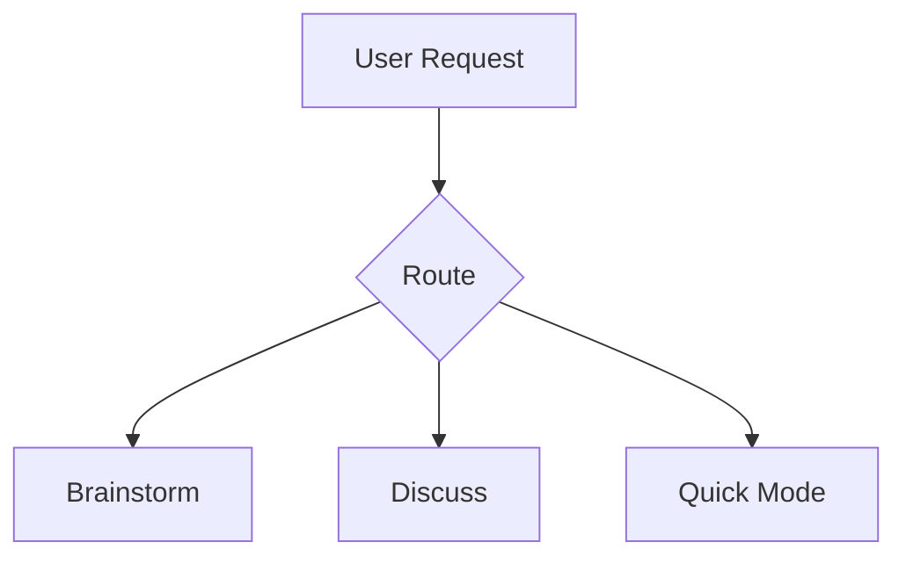

## Events

### Emits
- `plan_generated` — when Phase 3 completes and plan is saved
  - Payload: `{ plan_path, plan_title, task_count, wave_count }`
- `task_completed` — when the full brainstorm-to-plan cycle finishes
  - Payload: `{ task_title, plan_path, duration_ms }`

### Listens To
- `task_received` — begin ideation when ftm-mind routes an incoming task for exploration
  - Expected payload: `{ task_description, plan_path, wave_number, task_number }`
- `research_complete` — consume structured findings from ftm-researcher for the current research sprint
  - Expected payload: `{ query, mode, findings_count, consensus_count, contested_count, unique_count, sources_count, council_used, duration_ms }`

## Config Read

Before dispatching any agents, read `~/.claude/ftm-config.yml`:
- Use the `planning` model from the active profile for all research agents
- Example: if profile is `balanced`, agents get `model: opus`
- If config missing, use session default

## Blackboard Read

Before starting, load context from the blackboard:
1. Read `~/.claude/ftm-state/blackboard/context.json` — check current_task, recent_decisions, active_constraints
2. Read `~/.claude/ftm-state/blackboard/experiences/index.json` — filter by task_type "feature"/"investigation"
3. Load top 3-5 matching experience files for past brainstorm lessons
4. Read `~/.claude/ftm-state/blackboard/patterns.json` — check execution_patterns and user_behavior

If missing or empty, proceed without.

## Research Sprint Dispatch

Each research sprint invokes ftm-researcher rather than dispatching agents directly.

Interface:
- Pass: { research_question: [derived from current turn], context_register: [all prior findings], depth_mode: [based on turn number] }
- Receive: { findings, disagreement_map, confidence_scores }

Depth mode mapping:
- Turns 1-2 (BROAD): ftm-researcher quick mode (3 finders)
- Turns 3-5 (FOCUSED): ftm-researcher standard mode (7 finders + reconciler)
- Turns 6+ (IMPLEMENTATION): ftm-researcher deep mode (full pipeline with council)

The brainstorm skill consumes the researcher's structured output and weaves it into:
- 3-5 numbered suggestions with evidence and source URLs
- A recommended option with rationale
- Challenges based on contested claims from the disagreement map
- Targeted questions based on research gaps

---

# THE CORE LOOP

This skill is a **multi-turn research conversation**. Every single turn after the first follows the same cycle. There are no shortcuts, no collapsing turns, no "let me just generate the plan now."

```
EVERY TURN (after initial intake):
  1. RESEARCH SPRINT  — 7 agents search in parallel from different vectors + synthesizer reconciles
  2. SYNTHESIZE       — merge findings into suggestions with evidence
  3. CHALLENGE        — observations that push back on assumptions (NOT questions)
  4. ASK VIA UI       — use AskUserQuestion tool (1-4 questions, clickable options)
  5. >>> STOP <<<     — wait for the user. Do NOT continue.
```

The research sprints get progressively deeper. The questions get progressively sharper. Each cycle builds on everything before it. The goal is to extract the user's complete vision AND ground it in real-world evidence before generating any plan.

**Use `AskUserQuestion` for all questions.** This gives the user a clickable selection UI instead of making them type answers. Format every question with 2-4 labeled options, each with a short description of the trade-off. The user clicks their choice (or picks "Other" to type a custom answer). This is faster, less friction, and prevents answers from getting lost.

**Batching rules:** `AskUserQuestion` supports 1-4 questions per call. Use this intelligently:
- **Batch independent questions together** (up to 4) when the answer to one doesn't affect the options for another. Example: "Output format?" and "Config file approach?" are independent — batch them.
- **Ask sequentially** when answers are dependent — if the answer to question 1 changes what you'd ask for question 2, don't batch them. Ask question 1 first, process the answer, then ask question 2 on the next turn.
- **After each batch, run a research sprint** before asking the next batch. The answers may open new research directions.

**Use previews for concrete comparisons.** When options involve code patterns, file structures, or architectural layouts, use the `preview` field to show the user what each option looks like. Example: showing a flat transcript format vs a timestamped JSON format side by side.

**Use `multiSelect: true`** when choices aren't mutually exclusive. Example: "Which meeting apps should we support?" — the user might want both Zoom and Meet.

**Track what's been answered.** Before asking anything, check your context register. If the user already addressed a topic (even as an aside in a longer message), mark it answered and move on. Never re-ask something the user has already addressed, even if they answered it in a different format than you expected.

**You maintain a CONTEXT REGISTER** — a running mental document of everything learned so far. Every research sprint receives this register so agents don't re-search old ground. After each turn, append what you learned.

**You maintain a PRIOR DECISIONS LOG** — a structured record of every decision the user has made across ALL turns. Format:

```
PRIOR DECISIONS:
- D-01: [decision] (Turn N)
- D-02: [decision] (Turn N)
...
```

Before asking ANY question, check this log. If the user already decided something — even indirectly — do NOT re-ask. This log persists across sessions via ftm-pause/resume.

**Research depth escalates automatically:**
- **Turns 1-2: BROAD** — map the landscape, major approaches, who's done this
- **Turns 3-5: FOCUSED** — drill into the user's chosen direction, real trade-offs, failure modes
- **Turns 6+: IMPLEMENTATION** — concrete libraries, code patterns, integration specifics

---

# ANTI-RATIONALIZATION PROTOCOL

Every phase of this skill has moments where you'll be tempted to skip process. This table applies GLOBALLY — check it before every shortcut.

| Thought | Reality |
|---|---|
| "This idea is simple, skip deep research" | Simple ideas have hidden complexity. Research it. |
| "The user seems eager to code" | Eagerness isn't readiness. Finish the brainstorm. |
| "Research is returning similar results" | Similar ≠ saturated. Reformulate queries with more specific terms. |
| "I already know the best approach" | Your training data is stale. Search for what's current. |
| "The user answered enough questions" | You decide depth by research saturation, not question count. |
| "Let me just generate the plan now" | Phase 3 requires explicit user request. HARD GATE. |
| "This is just a quick feature" | Quick features become complex systems. Research it. |
| "I can skip the pre-mortem, the plan looks solid" | That's exactly when pre-mortems catch things. Run it. |
| "The assumption audit would slow us down" | Crackable assumptions caught now save weeks of rework. |
| "One more turn won't surface anything new" | Run the sprint. Let the research prove it, don't assume it. |
| "The user already validated this approach" | Validation from the user ≠ validation from evidence. |

**Red flags in your own behavior:**
- Generating suggestions without dispatching agents first → STOP
- Offering to move to Phase 3 before the user asks → STOP
- Asking a question the user already answered → check context register
- Presenting only one approach → you haven't researched enough
- Skipping challenges because everything looks good → research harder

---

# PHASE 0: REPO SCAN (automatic, silent)

Run this in the background before your first response. Do not ask.

Spawn an **Explore** agent (subagent_type: Explore):
```
Analyze the current repository: project type, tech stack, architecture,
patterns in use, existing infrastructure, scale indicators.
Focus on what's relevant for proposing new features or architectural changes.
Map: reusable assets, established patterns, integration points, dependency graph highlights.
```

Store as your project context. Reference throughout all phases. If not in a git repo, skip and ask about stack during intake.

---

# PHASE 1: INTAKE

Detect which path you're on:

## Path A: Fresh Idea (short/vague message)

**Questioning philosophy (from GSD):** This is dream extraction, not requirements gathering. You're a thinking partner, not an interviewer. Start open — let them dump their mental model. Follow energy — whatever they emphasized, dig into that. Challenge vagueness — "good" means what? "users" means who? "simple" means how? Make the abstract concrete — "walk me through using this."

**Anti-patterns to avoid:**
- Checklist walking (going through domains regardless of what they said)
- Canned questions ("What are your success criteria?" regardless of context)
- Corporate speak ("Who are your stakeholders?")
- Interrogation (firing questions without building on answers)
- Rushing (minimizing questions to get to "the work")
- Shallow acceptance (taking vague answers without probing)
- Premature constraints (asking about tech stack before understanding the idea)
- Asking about user's skills (NEVER ask about technical experience — Claude builds)

**Turn 1 ONLY:** Ask ONE question to understand the core idea — the single most important unknown. If the opening message covers basics (what, who, problem), skip to the first research sprint.

**>>> STOP. Wait for response. <<<**

**Turn 2:** Take the user's answer. NOW run your first research sprint (7 agents, BROAD depth — see Phase 2). Synthesize, challenge (observations only), then ask ONE question — the single most important decision point that research surfaced. Frame it with specific options from the research.

**>>> STOP. Wait for response. <<<**

**Turn 3+:** You're now in the core loop. Every turn from here follows the cycle: research sprint -> synthesize -> challenge (observations) -> ask via AskUserQuestion -> STOP.

## Path B: Brain Dump (large paste, notes, transcript)

**Turn 1:** Parse the entire paste. Extract: decisions already made, open questions, assumptions to validate, contradictions, gaps. Present structured summary. Then ask ONE confirmation question — the single biggest gap or ambiguity. Do NOT ask basic questions already answered in the paste. Do NOT list all open questions — pick the most critical one.

**>>> STOP. Wait for confirmation. <<<**

**Turn 2:** Take the confirmation. Run first research sprint in BRAIN DUMP MODE (agents search for each specific architectural claim from the paste). Present novelty map. Synthesize, challenge (observations only), then ask ONE question about the most important decision point the research surfaced.

**>>> STOP. Wait for response. <<<**

**Turn 3+:** Core loop continues. One question per turn.

---

# DISCUSS MODE

When the user provides a clear, specific spec or feature description (not a vague idea), skip broad research and go straight to targeted analysis.

## Detection

Discuss mode activates when:
- The user's input is 200+ words with specific technical details
- The user says "I know what I want to build" or "here's my spec" or "discuss this"
- The input contains file paths, function names, or architecture details
- The user explicitly requests "discuss" rather than "brainstorm"

## Flow

Instead of the standard brainstorm research -> synthesis -> suggestions flow:

1. **Parse the spec** — Extract: what's being built, key components, tech stack, constraints
2. **Identify gray areas** — Use the Gray Area Detection Heuristics (see module below) to systematically find unknowns
3. **Ask targeted questions** — Present 3-5 specific questions about the gray areas via AskUserQuestion
4. **Refine based on answers** — Each answer narrows the spec. After 2-3 rounds of Q&A, the spec should be implementation-ready.
5. **Output: implementation-ready spec** — Not a brainstorm document, but a tight spec that can feed directly into plan generation.

---

# PHASE 2: RESEARCH + CHALLENGE LOOP

This is the heart of the skill. Unlimited turns. Each one follows the cycle.

## Step 1: Dispatch Research Sprint

Every turn, read `references/agent-prompts.md` and spawn **7 parallel agents + 1 synthesizer** (subagent_type: general-purpose, model: from ftm-config `planning` profile). Each agent gets:

1. **Project context** from Phase 0
2. **Full context register** — everything learned across ALL prior turns
3. **Prior decisions log** — every decision made so far
4. **Research depth level** for this turn (broad/focused/implementation)
5. **Previous findings summary** so they don't re-search
6. **This turn's specific research question** — derived from what the user just said
7. **Brain dump claims** if Path B

The 7 agents search from different vectors:
- **Web Researcher** — blog posts, case studies, architectural write-ups
- **GitHub Explorer** — repos, code patterns, open-source implementations
- **Competitive Analyst** — products, tools, market gaps, user complaints
- **Stack Researcher** — tech stack evaluation, library comparison, dependency risks
- **Architecture Researcher** — system design patterns, scaling approaches, failure modes at scale
- **Pitfall Researcher** — anti-patterns, post-mortems, "what went wrong" case studies
- **UX/Domain Researcher** — UX patterns, accessibility standards, domain-specific conventions

After all 7 return, dispatch the **Synthesizer** agent which receives ALL findings and produces:
- **Consensus claims** — things multiple agents agree on
- **Contested claims** — things agents disagree on (with the disagreement explained)
- **Unique insights** — things only one agent found that are noteworthy
- **Research gaps** — what nobody found (gaps are signal)
- **Confidence scores** — per-finding confidence based on source quality and agreement

Each turn's research question should be DIFFERENT from the last. The user's response reveals new angles, constraints, or decisions — use those to formulate new, more specific search queries. If the user chose approach A over B, this turn's research digs into A's implementation details, not the broad landscape again.

## Step 2: Synthesize into 3-5 Suggestions

Once the synthesizer returns, merge findings into **3-5 numbered suggestions**. Lead with your recommendation.

Each suggestion needs:
1. **The suggestion** — concrete and actionable
2. **Real-world evidence** — which search results back this up, with URLs
3. **Why this matters** — specific advantage for this project
4. **Trade-off** — what you give up
5. **Confidence** — high/medium/low based on synthesizer's confidence scores

Label suggestion #1 as **RECOMMENDED** with a "Why I'd pick this" rationale.

If research was thin, present fewer suggestions. Quality over quantity. If all agents returned weak results, be honest: "Research didn't surface strong prior art — this might be genuinely novel, or we should reframe the search."

**Brain dump mode:** Present a **Novelty Map** table before suggestions:

| Brain Dump Claim | Verdict | Evidence |
|---|---|---|
| [claim] | Solved / Partially Solved / Novel | [link or explanation] |

## Step 3: Challenge (Observations, NOT Questions)

After suggestions, share 2-3 observations that challenge or refine the user's thinking. These are STATEMENTS, not questions. The user can respond to them if they want, but they don't create answer obligations.

Good challenge formats (declarative):
- **"Worth noting that..."** — surface a pattern they may not know about
- **"At scale, X typically becomes a bottleneck because..."** — flag edge cases
- **"The evidence suggests X contradicts the assumption about Y..."** — when research contradicts something
- **"Successful implementations of this (e.g., [product]) launched with only..."** — YAGNI signal
- **"Users of [product] reported frustration with..."** — inject real feedback
- **"The pitfall research surfaced that teams who tried X typically hit Y within Z months..."** — failure mode warning

Bad challenge formats (these are disguised questions — do NOT use):
- ~~"Have you considered..."~~ — this demands a yes/no answer
- ~~"What happens when..."~~ — this demands the user think through a scenario
- ~~"How would you handle..."~~ — this is just a question with extra steps

**YAGNI instinct:** Actively look for scope to cut. If research shows successful products launched with less, state it as an observation.

## Step 4: Ask Questions via AskUserQuestion

Use the `AskUserQuestion` tool for every question. Never just type a question in chat — always use the tool so the user gets the clickable selection UI.

**Maintain a question queue internally.** Prioritize by:
1. Which question unlocks the most downstream decisions (answering it resolves or narrows others)
2. Which requires the user's judgment (can't be answered by more research)
3. Which has the highest impact on the architecture

**Batch independent questions (up to 4 per call).** Review your queue — if the top 2-3 questions don't depend on each other's answers, send them in a single `AskUserQuestion` call. The user clicks through them quickly in the UI. If answers ARE dependent, send only the blocking question and save the rest.

**Format each question well:**
- `header`: Short tag, max 12 chars (e.g., "Output", "Trigger", "Auth")
- `options`: 2-4 choices, each with a clear `label` (1-5 words) and `description` (trade-off explanation)
- Put your recommended option first with "(Recommended)" in the label
- `multiSelect: true` when choices aren't exclusive
- `preview` for code/config/layout comparisons

Some questions will become unnecessary as earlier answers clarify things — drop them from the queue when that happens.

**When your initial question queue runs dry, DO NOT suggest wrapping up.** Instead, run a fresh research sprint using EVERYTHING you've learned so far. This sprint should go deeper than any previous one because now you have the user's full picture. The research will surface new unknowns, edge cases, failure modes, and implementation details that generate NEW questions. Present the findings with new suggestions and observations, then ask ONE question from the new unknowns the research surfaced. The loop keeps going — research always generates more questions if you dig deep enough.

**Research-driven question generation:** After each research sprint, actively mine the findings for questions the user hasn't considered yet. Examples: "The research surfaced that CoreAudio Taps require re-granting permissions weekly on Sonoma — how do you want to handle that UX?" or "Three of the repos I found use a daemon model instead of start/stop — worth considering?" The best brainstorms surface things the user didn't know to ask about. If your research isn't generating new questions, your research queries aren't specific enough — reformulate and go deeper.

**After your question, signal what's next.** Something like: "Answer this and I'll dig into [next topic area]." Do NOT offer to move to planning — let the user tell you when they're ready. The user should never feel like the brainstorm is wrapping up unless THEY decide it is.

## Step 5: STOP

**>>> STOP. Do NOT continue to the next turn. Wait for the user. <<<**

This is non-negotiable. The user's response is the input for the next research sprint. Without it, the next sprint has nothing new to search for.

---

# CREATIVITY MODULES

These modules activate at specific points in the brainstorm based on context. Each is a self-contained technique that can also be invoked explicitly by the user saying "run [module name]". When a module activates, announce it: "Activating [module] to [purpose]."

---

## Module: GRAY AREA DETECTION

**Activates:** Automatically in Discuss Mode. Also runs once during Phase 2 after feature type is detected.

**Source:** GSD discuss-phase heuristics

Systematically identify unknowns by categorizing what the feature involves:

| Category | Heuristic | Example Gray Areas |
|---|---|---|
| Something users **SEE** | Visual presentation, interactions, states | Layout density? Responsive approach? Loading/empty/error states? Animation? |
| Something users **CALL** | Interface contracts, responses, errors | REST vs GraphQL? Auth mechanism? Pagination? Error codes? Versioning? |
| Something users **RUN** | Invocation, output, behavior modes | Interactive or batch? Output format? Config approach? Daemon vs one-shot? |
| Something users **READ** | Structure, tone, depth, flow | Content hierarchy? Tone? Depth levels? Navigation? |
| Something being **ORGANIZED** | Criteria, grouping, exception handling | Sort/filter logic? Grouping rules? Edge case handling? |

**Feature-Type Specific Gray Areas:**

| Feature Type | Signals | Key Gray Areas |
|---|---|---|
| UI/Frontend | "page", "component", "dashboard" | Layout density, responsive approach, loading/empty/error states, accessibility |
| API/Backend | "endpoint", "API", "service" | REST vs GraphQL, auth mechanism, pagination, rate limiting, versioning |
| Data/Storage | "database", "store", "persist" | SQL vs NoSQL, read/write ratio, consistency requirements, migration strategy |
| Integration | "connect to", "sync with" | Push/pull/both, real-time or batch, retry handling, data mapping |
| Automation | "automate", "trigger", "schedule" | Trigger mechanism, failure notification, idempotency, monitoring |
| CLI Tool | "command", "CLI", "terminal" | Interactive or not, output format, config approach, distribution, daemon vs one-shot, error recovery, shell completions |
| AI/ML | "AI", "model", "generate", "LLM" | Which model, latency tolerance, fallback, cost ceiling, eval strategy |

Present discovered gray areas via AskUserQuestion, letting the user select which ones to discuss (multiSelect: true).

---

## Module: FIRST PRINCIPLES ASSUMPTION AUDIT

**Activates:** Once, during turns 2-3 when the problem space is defined but before deep research begins. Also activatable via "audit assumptions" or "challenge my assumptions."

**Purpose:** Surface hidden assumptions that constrain the solution space unnecessarily.

**Process — spawn 1 agent (subagent_type: general-purpose):**

```
You are conducting a First Principles Assumption Audit. Analyze the following idea
and extract assumptions at 5 levels:

IDEA: {user's idea + context register}

Level 1 — SURFACE ASSUMPTIONS (observable):
  What behaviors, features, or outcomes is the user assuming?

Level 2 — PROCESS ASSUMPTIONS (how things "should" work):
  What workflows, sequences, or methods is the user taking for granted?

Level 3 — STRUCTURAL ASSUMPTIONS (constraints treated as fixed):
  What technical, organizational, or resource constraints are being accepted without question?

Level 4 — CULTURAL ASSUMPTIONS (beliefs about users/market):
  What beliefs about user behavior, market needs, or competitive landscape are implicit?

Level 5 — FUNDAMENTAL ASSUMPTIONS (psychological/systemic):
  What deeper truths about human behavior or system dynamics are being assumed?

For each assumption, classify as:
- VALID: supported by evidence, should keep
- QUESTIONABLE: might not hold, worth investigating
- CRACKABLE: presented as unchangeable but is actually a design choice — HIGH VALUE

Return as a structured list with level, assumption text, classification, and why.
```

**Present to user as:**
```
Assumption Audit — [N] assumptions found, [M] crackable:

CRACKABLE (design choices disguised as constraints):
- [assumption] — Why it's crackable: [explanation]

QUESTIONABLE (worth investigating):
- [assumption] — Why it's questionable: [explanation]

VALID (keep these):
- [assumption] — Supporting evidence: [brief]
```

Let user mark each as "keep", "challenge", or "ignore" via AskUserQuestion. Crackable assumptions become research targets for the next sprint.

---

## Module: MULTI-PERSPECTIVE STAKEHOLDER SIMULATION

**Activates:** When 3+ viable approaches exist and the user needs help choosing. Also activatable via "get perspectives" or "what would [stakeholder] think?"

**Purpose:** Eliminate blind spots by forcing analysis through multiple distinct viewpoints.

**Process — spawn 4-6 parallel agents, each roleplaying a domain-specific persona:**

Select personas based on the project context. Default set:

| Persona | Lens | Key Question |
|---|---|---|
| The Skeptical CFO | ROI, cost, sustainability | "Justify every dollar and hour." |
| The Overwhelmed User | Simplicity, time-to-value | "I have 5 minutes. Can I figure this out?" |
| The Security Auditor | Attack vectors, data exposure | "What can go wrong? What data is at risk?" |
| The Competitor PM | Defensibility, differentiation | "How would I copy this? What's the moat?" |
| The Support Lead | Failure modes, confusion points | "What tickets will this generate?" |
| The 5-Year Maintainer | Tech debt, scalability, clarity | "Will this still make sense? What rots?" |

Each agent receives the current top 3 approaches and evaluates them through their persona's lens.

**Present as a matrix:**

| Approach | CFO | User | Security | Competitor | Support | Maintainer |
|---|---|---|---|---|---|---|
| Option A | verdict | verdict | verdict | verdict | verdict | verdict |
| Option B | verdict | verdict | verdict | verdict | verdict | verdict |
| Option C | verdict | verdict | verdict | verdict | verdict | verdict |

Highlight cells where a persona strongly objects (risk) or strongly endorses (opportunity).

---

## Module: PRE-MORTEM STRESS TEST

**Activates:** Automatically between Phase 2 (brainstorm complete) and Phase 3 (plan generation). Also activatable via "stress test this" or "what could go wrong?"

**Purpose:** Imagine the project has already failed, work backward to identify why. Research shows this increases failure prediction accuracy by 30%.

**Process — spawn 1 agent (subagent_type: general-purpose):**

```
You are conducting a Pre-Mortem Analysis. The project described below has ALREADY
FAILED SPECTACULARLY 6 months from now. Your job is to explain why.

PROJECT: {vision summary from context register}
APPROACH: {chosen architecture/pattern}
KEY DECISIONS: {prior decisions log}

Generate 10+ failure scenarios across these categories:
1. TECHNICAL: architecture breaks, scaling fails, integration nightmares
2. MARKET: no demand, wrong timing, competitor moves
3. EXECUTION: timeline slips, scope creep, key dependency fails
4. USER ADOPTION: confusing UX, wrong assumptions about behavior, trust issues
5. EXTERNAL: regulation changes, dependency deprecated, API pricing changes

For each failure:
- Likelihood: high/medium/low
- Impact: catastrophic/major/minor
- Leading indicator: what early signal would warn you?
- Mitigation: what would prevent or reduce this?

Rank by (Likelihood x Impact). Return top 10.
```

**Present to user:**

```
Pre-Mortem: Top 5 ways this could fail

1. [TECHNICAL] [failure] — Likelihood: high, Impact: major
   Leading indicator: [signal]
   Mitigation: [strategy]
   
2. ...
```

Ask user which mitigations to fold into the plan via AskUserQuestion (multiSelect: true). Selected mitigations become explicit tasks in Phase 3.

---

## Module: ANALOGICAL REASONING ENGINE

**Activates:** During BROAD depth (turns 1-2) when exploring the solution space. Also activatable via "find analogies" or "what's this like in other domains?"

**Purpose:** Find solutions in unrelated domains and transfer principles back. Research shows analogical transfer produces significantly more novel and useful ideas than conventional brainstorming.

**Process — spawn 1 agent:**

```
You are the Analogical Reasoning Engine. Your job is to find solutions to this
problem in COMPLETELY UNRELATED domains, then transfer the principles back.

PROBLEM: {user's problem}
ABSTRACT VERSION: {abstract the problem to its essence — e.g., "user retention" becomes
"maintaining engagement of voluntary participants"}

Step 1: Identify 4-5 analogous domains where this abstract problem has been solved:
  - One from biology/nature
  - One from gaming/entertainment
  - One from a traditional industry (manufacturing, agriculture, logistics)
  - One from psychology/behavioral science
  - One from an unexpected domain (religion, sports, music, cooking)

Step 2: For each domain, extract the principle that solves the abstract problem.
  Example: Biology -> "Create an environment where leaving is costly" (ecosystem lock-in)

Step 3: Transfer each principle back to the original problem domain.
  Example: "What if our app had visible skill trees like an RPG?"

Step 4: Rate each transferred idea:
  - Novelty: how different is this from obvious approaches? (1-5)
  - Feasibility: how hard to implement? (1-5)
  - Potential: if it works, how impactful? (1-5)

Return the top 3-5 transferred ideas with the full reasoning chain.
```

Present as numbered ideas with the analogy chain visible: Domain -> Principle -> Transferred Idea.

---

## Module: CONSTRAINT STORMS

**Activates:** When the brainstorm feels stuck or suggestions are too similar/conventional. Also activatable via "constrain this" or "force creativity."

**Purpose:** Impose artificial constraints to force creative solutions. Ideas that survive after removing constraints are genuinely novel.

**Process — spawn 3 parallel agents, each with a different constraint set:**

Constraint categories (pick 1 from each for each agent):
1. **RESOURCE**: "Zero budget", "One person", "No code", "Weekend project"
2. **TIME**: "Ship in 48 hours", "MVP in 1 hour", "Prototype today"
3. **TECHNOLOGY**: "No database", "No API calls", "Browser-only", "CLI-only", "No dependencies"
4. **AUDIENCE**: "For 80-year-olds", "For children", "For non-English speakers", "For offline users"
5. **INVERSION**: "User pays YOU", "It's hardware not software", "It's a game not a tool", "It's temporary not permanent"

Each agent generates 3-5 solutions under their constraint set.

**Present to user:**

```
Constraint Storm Results:

Under "zero budget + browser-only + for offline users":
1. [solution] — survives without constraint? YES/NO
2. [solution] — survives without constraint? YES/NO

Under "ship in 48 hours + no dependencies + for children":
1. [solution] — survives without constraint? YES/NO
...

Surviving ideas (viable even without constraints):
- [idea 1] — born from [constraint], core insight: [what makes it good]
- [idea 2] — ...
```

The surviving ideas are the gold. Present them as additional suggestions in the next synthesis.

---

## Module: REVERSE BRAINSTORM

**Activates:** When suggestions cluster in conventional categories (AI fixation bias detected). Also activatable via "reverse brainstorm" or "break my thinking."

**Purpose:** Generate deliberately terrible ideas, then invert them. Breaks fixation bias.

**Process — inline (no agent needed):**

1. Generate 5-7 ways to make the product/feature WORSE:
   - "Make onboarding take 45 minutes"
   - "Require a fax machine to sign up"
   - "Send 50 emails a day"

2. Invert each:
   - "Onboarding in under 45 seconds"
   - "Sign up with zero forms — just a phone number"
   - "Zero emails — everything in-app, user-initiated"

3. Evaluate inversions as genuine proposals.

Present the inversions that are genuinely viable as additional suggestions.

---

## Module: WEIGHTED DECISION MATRIX

**Activates:** When converging on a final approach from 3+ options. Also activatable via "score these" or "help me decide."

**Purpose:** Replace subjective "which do you like?" with quantified evaluation.

**Process:**

1. **Define criteria** (suggest defaults, let user customize via AskUserQuestion):
   - Impact (1-5)
   - Feasibility (1-5)
   - Time to implement (1-5)
   - Strategic alignment (1-5)
   - Risk level (1-5, inverted — low risk = high score)

2. **Assign weights** (ask user via AskUserQuestion):
   - Impact: ?x weight (default 3x)
   - Feasibility: ?x weight (default 2x)
   - Time: ?x weight (default 1x)
   - etc.

3. **Score each option** against each criterion with rationale

4. **Calculate weighted totals**, rank

5. **Present as table:**

| Option | Impact (3x) | Feasibility (2x) | Time (1x) | Alignment (2x) | Risk (1x) | **Total** |
|---|---|---|---|---|---|---|
| A | 4 (12) | 3 (6) | 5 (5) | 4 (8) | 3 (3) | **34** |
| B | 5 (15) | 2 (4) | 2 (2) | 5 (10) | 2 (2) | **33** |

6. **Sensitivity analysis:** "If you cared more about speed than impact, option B drops to #3 and option C rises to #1."

---

## Module: DIVERGE/CONVERGE PHASE CONTROLLER

**Activates:** Automatically manages the brainstorm's creative phases. Not user-invokable directly.

**Purpose:** Prevent premature convergence. Research shows AI tools evaluate ideas too early, killing creative potential.

**Rules:**

During **DIVERGE phases** (turns 1-3, and whenever exploring new sub-problems):
- Suppress evaluation language ("best", "recommended", "should")
- Push for quantity: "What ELSE could this look like?"
- Activate Analogical Reasoning, Constraint Storms, Reverse Brainstorm
- DO NOT label anything as RECOMMENDED
- Present ALL options as equally valid for now

During **CONVERGE phases** (turns 4+ when the user signals preference, and before Phase 3):
- Activate Weighted Decision Matrix, Stakeholder Simulation
- Label recommendations
- Compare and rank
- Cut scope aggressively (YAGNI)

**Announce transitions:** "We've explored the space — shifting to evaluation mode to narrow down."

The user can override: "keep exploring" → back to DIVERGE. "help me choose" → switch to CONVERGE.

---

## Module: VISUAL COMPANION

**Activates:** When the brainstorm involves visual decisions — UI layouts, information architecture, workflow diagrams, comparison matrices.

**Purpose:** Show, don't tell. Present mockups and diagrams in the browser alongside terminal conversation.

**Process:**

For each visual decision point, decide: does this need a visual? If the user needs to compare layouts, see a workflow, or understand spatial relationships — yes.

Use the `preview` field in AskUserQuestion for simple comparisons (code layouts, file structures, config formats).

For complex visuals (UI mockups, architecture diagrams, flow charts), use Mermaid syntax in the response and note that the user can paste it into a renderer if needed. Format:



---

## Module: SPEC SELF-REVIEW

**Activates:** Automatically after Phase 2 summary is approved, before Phase 3 plan generation begins.

**Source:** Superpowers spec-document-reviewer

**Purpose:** Catch issues in the accumulated decisions before they become plan defects.

**Checklist (run through mentally, fix issues inline):**

1. **Placeholder scan** — Are there any TBD, TODO, "we'll figure this out later" items? Surface them now.
2. **Internal consistency** — Do any decisions contradict each other? (e.g., "real-time" in one place, "batch" in another)
3. **Scope check** — Is anything included that wasn't discussed? Is anything discussed but missing?
4. **Ambiguity check** — Could any decision be interpreted two different ways by an implementer?
5. **Completeness** — Are all gray areas resolved? Any feature-type-specific gaps (see Gray Area Detection)?
6. **YAGNI sweep** — One final pass: can anything be cut without losing core value?

**Present findings to user:** "Before I generate the plan, I found [N] issues in our accumulated decisions: [list]. Let me resolve these."

Fix issues inline. If any require user input, ask via AskUserQuestion before proceeding.

---

# SCOPE GUARDRAIL

**Source:** GSD discuss-phase

The brainstorm's scope, once established in Phase 1, is FIXED in terms of WHAT we're building. Phase 2 discussions clarify HOW to implement what's scoped, never WHETHER to add new capabilities.

When the user raises something that expands scope during Phase 2:
1. Acknowledge it's a good idea
2. Add it to a **Deferred Ideas** list in the context register
3. Redirect: "That's worth building, but it's scope expansion. Let's nail the core first and revisit after."
4. Continue with the current scope

The Deferred Ideas list is included in the Phase 3 plan as a "Future Work" section.

Exception: if the user explicitly says "I want to change the scope" or "add this to v1", honor it and update the context register.

---

# When to Suggest Phase 3

**Depth is dynamic, not counted.** Don't track a minimum question number. Instead, measure whether your research is still producing new, useful information. The brainstorm is deep enough when research sprints stop surfacing unknowns — not when you've hit some arbitrary question count. A simple CLI wrapper might genuinely need 3-4 questions. A distributed system with multiple integration points might need 15. Let the research tell you.

**How to judge depth: the "new information" test.** After each research sprint, ask yourself: did this sprint surface anything the user hasn't already addressed or that I couldn't have inferred from prior answers? If yes, there's more to explore — formulate a question from the new finding. If two consecutive sprints return the same repos, same patterns, and no new unknowns, the research is saturated for this idea.

**The key behavior change: when your question queue empties, don't offer to wrap up — run another research sprint first.** The sprint might surface new angles (failure modes, deployment concerns, maintenance patterns, edge cases from similar projects) that generate fresh questions. Only when the sprint comes back dry should you consider the brainstorm naturally complete.

**Never proactively suggest Phase 3.** Don't say "Ready to turn this into an implementation plan?" or "Want to move to planning?" or any variation. Instead, when research is genuinely saturated, just ask your next research-driven question. If there truly isn't one, present your latest findings and observations — the user will tell you when they're ready to move on. The user controls the pace, not you.

**The one exception:** If research has been genuinely dry across 2+ consecutive sprints AND you have no new questions, you may say something like: "I've dug into [X, Y, Z areas] and the research is converging — happy to keep exploring if there's anything else on your mind, or we can shape this up." This is a status update, not a push. Say it once. If the user asks anything, go back to the research loop.

**Before Phase 3, scan your context register.** Every question you've asked should have an answer recorded. If any are unanswered, ask them ONE AT A TIME in subsequent turns before Phase 3. Do NOT re-ask questions the user already answered — even if their answer was embedded in a longer message or phrased differently than expected.

**HARD GATE: The user must explicitly say they're ready.** When they do, activate the following sequence:

1. **Spec Self-Review** module runs
2. **Pre-Mortem Stress Test** module runs
3. Present combined summary:

```
Here's what I think we've landed on:

**Building:** [one sentence]
**Core approach:** [recommended architecture/pattern]
**Key decisions:** [2-3 bullets from prior decisions log]
**Scope for v1:** [what's in, what's deferred]
**Top risks (from pre-mortem):** [2-3 bullets with mitigations]
**Canonical references:** [links to key specs, docs, or ADRs that implementers must read]
```

Then proceed to Phase 3. If they raise corrections, address them before proceeding.

---

# PHASE 3: PLAN GENERATION

Read `references/plan-template.md` for the full template and rules. Present the plan incrementally (vision -> tasks -> agents/waves), getting approval at each step.

## Plan Quality Verification Loop

**Source:** GSD plan-checker

After generating the plan, spawn a **Plan Checker** agent (subagent_type: general-purpose):

```
You are the Plan Quality Reviewer. Review the following implementation plan against
the brainstorm decisions and spec.

PLAN: {full plan text}
SPEC DECISIONS: {prior decisions log + context register}
PROJECT CONTEXT: {Phase 0 repo scan}

Check:
1. SPEC COVERAGE — Does every decision from the brainstorm appear in a task? Flag gaps.
2. PLACEHOLDER SCAN — Any vague instructions, TBDs, or "figure this out" in tasks? Flag all.
3. TASK DECOMPOSITION — Is every task completable in one agent session? Flag too-large tasks.
4. BUILDABILITY — Can tasks be executed in the stated order? Flag dependency issues.
5. NYQUIST VALIDATION — Does every task have testable acceptance criteria with an automated verify command?
6. WIRING COMPLETENESS — Are all exports/imports/routes specified? Flag orphaned components.
7. YAGNI — Are any tasks not traceable to a brainstorm decision? Flag for removal.

Return: list of issues by category, severity (blocker/warning/nit), and suggested fix.
```

If the checker finds blockers, fix them and re-check. Up to 3 iterations. After 3, present remaining issues to the user.

## Discovery Levels

**Source:** GSD plan-phase

When generating tasks, assess each task's discovery level:

- **Level 0 (Skip):** Pure internal work, existing patterns. No research needed.
- **Level 1 (Quick Verify):** Single known library, confirm syntax. 2-5 min research.
- **Level 2 (Standard):** Choosing between options, new integration. 15-30 min research.
- **Level 3 (Deep Dive):** Architectural decisions, novel problems. Extended research.

Tag each task with its discovery level. Level 2+ tasks get research hints from the brainstorm's findings.

---

# COMPLEXITY MODES

**Source:** GSD quick/fast/full routing

The skill auto-detects complexity but can be overridden.

## Quick Mode

**Detects:** Simple, well-understood tasks. User says "quick brainstorm" or the idea is clearly scoped.

- 3 agents instead of 7 (Web, GitHub, Competitive only)
- 2-3 turns max before suggesting Phase 3
- Skip Assumption Audit, Stakeholder Sim, Constraint Storms
- Keep: Gray Area Detection, Pre-Mortem (abbreviated)

## Standard Mode (default)

- Full 7 agents + synthesizer
- Unlimited turns
- All modules available, activated by context
- Full Pre-Mortem and Spec Self-Review before Phase 3

## Deep Mode

**Detects:** Complex, multi-system, high-stakes projects. User says "deep brainstorm" or the idea spans multiple domains.

- Full 7 agents + synthesizer
- Unlimited turns
- ALL modules activate at least once
- Assumption Audit runs on turns 2-3
- Stakeholder Simulation runs when 3+ approaches exist
- Constraint Storms run at least once
- Weighted Decision Matrix runs before convergence
- Analogical Reasoning runs during BROAD phase
- Double Pre-Mortem: once mid-brainstorm, once before Phase 3
- Plan Verification Loop always runs full 3 iterations

---

## Relationship to superpowers:brainstorming

**ftm-brainstorm absorbs superpowers:brainstorming.** This skill handles ALL brainstorming:
- Idea exploration with live research (formerly ftm-brainstorm only)
- Design/spec work with gray area detection (formerly superpowers:brainstorming)
- Discuss mode for known specs (formerly GSD discuss-phase)
- Quick mode for simple tasks (formerly GSD quick)

If user invokes superpowers:brainstorming, redirect here. If user already completed a brainstorm, point to ftm-executor.

---

## Context Compression

After turn 5 in a brainstorm session, earlier turns start consuming significant context. Apply compression to maintain quality in later turns.

### Trigger

- Turns 1-5: No compression. Full fidelity.
- Turn 6+: Compress turns 1 through (current - 3). Keep the 3 most recent turns at full fidelity.

### Compression Strategy

For each compressed turn, replace the full content with a summary:

```
[Turn N summary]
- Topic: [what was discussed]
- Key decisions: [bullet list of decisions made]
- Open questions resolved: [what was answered]
- Artifacts produced: [any specs, diagrams, code snippets referenced]
- Module activations: [which creativity modules ran and their output]
```

### What to Preserve in Summaries

- Decisions and their rationale (WHY something was decided)
- Constraints discovered
- Requirements confirmed by the user
- Technical choices made
- Pre-mortem mitigations selected
- Assumption audit results
- Stakeholder simulation verdicts

### What to Drop

- Exploratory tangents that were abandoned
- Research citations already synthesized
- Verbose explanations of options not chosen
- Repeated context that's already captured in later turns
- Full agent outputs (keep synthesis only)

### Implementation

This is implemented at the skill level, not via hooks. When presenting a response at turn 6+:
1. Mentally compress old turns using the strategy above
2. Reference compressed summaries when needed
3. Keep recent turns verbatim for conversational continuity
4. If the user references something from a compressed turn, expand it on demand

---

## Session State (for ftm-pause/resume)

When paused, the following state must be capturable so ftm-resume can pick up exactly where you left off:

- **Phase tracking**: current phase (0/1/2/3), path (A/B/Discuss), turn number, research depth level, complexity mode (quick/standard/deep)
- **Phase 0**: full repo scan results (or "skipped — no git repo")
- **Phase 1**: original idea (verbatim), brain dump extraction if Path B, all user answers per round
- **Phase 2**: every completed turn's suggestions with evidence/URLs, every challenge and response, every question and answer, accumulated decisions, the current direction, context register contents, prior decisions log, deferred ideas list, diverge/converge phase state
- **Module state**: assumption audit results, stakeholder sim matrix, pre-mortem results, constraint storm survivors, decision matrix scores
- **Phase 3**: which sections presented/approved, plan content so far, plan file path if saved, plan checker iteration count

This state is what ftm-pause captures and ftm-resume restores. Keep it current as you go.

## Blackboard Write

After completing, update:
1. `~/.claude/ftm-state/blackboard/context.json`:
   - Set current_task status to "complete"
   - Append decision summary to recent_decisions (cap at 10)
   - Update session_metadata.skills_invoked and last_updated
2. Write experience file to `~/.claude/ftm-state/blackboard/experiences/YYYY-MM-DD_task-slug.json`:
   - task_type: "feature" or "investigation"
   - feature_type: detected type (UI, API, etc.)
   - architectural_direction: the approach chosen
   - research_quality: how useful the research sprints were (high/medium/low)
   - turns_to_resolution: how many Phase 2 turns before Phase 3
   - modules_activated: which creativity modules ran and their impact
   - assumption_audit_results: crackable assumptions found
   - pre_mortem_top_risks: top 3 risks and whether mitigations were adopted
   - tags: keywords for future matching
3. Update `experiences/index.json` with the new entry
4. Emit `plan_generated` with `{ plan_path, plan_title, task_count, wave_count }` (if Phase 3 completed)
5. Emit `task_completed` with `{ task_title, plan_path, duration_ms }`

## Requirements

- config: `~/.claude/ftm-config.yml` | optional | model profile for planning agents
- reference: `references/agent-prompts.md` | required | research agent prompt templates (7 agents + synthesizer)
- reference: `references/plan-template.md` | required | plan document generation template
- reference: `~/.claude/ftm-state/blackboard/context.json` | optional | session state and active constraints
- reference: `~/.claude/ftm-state/blackboard/experiences/index.json` | optional | past brainstorm lessons
- reference: `~/.claude/ftm-state/blackboard/patterns.json` | optional | execution and user behavior patterns

## Risk

- level: low_write
- scope: writes plan documents to ~/.claude/plans/; writes blackboard context and experience files; does not modify project source code
- rollback: delete generated plan file; blackboard writes can be reverted by editing JSON files

## Approval Gates

- trigger: Phase 3 plan generation ready | action: run Spec Self-Review + Pre-Mortem, present "Here's what I think we've landed on" summary, wait for explicit user approval
- trigger: plan document generated | action: present plan incrementally (vision -> tasks -> agents/waves), get approval at each step, run Plan Checker before final save
- trigger: research returns thin results on all agents | action: note research gaps, present fewer suggestions, do not fabricate citations
- trigger: module activation | action: announce which module is activating and why
- complexity_routing: micro -> auto | small -> auto | medium -> plan_first | large -> plan_first | xl -> always_ask

## Fallbacks

- condition: ftm-researcher not available | action: dispatch 7 direct parallel research agents using built-in prompts from references/agent-prompts.md + synthesizer
- condition: no git repo detected in Phase 0 | action: skip repo scan, ask about tech stack during intake
- condition: blackboard missing or empty | action: proceed without experience-informed shortcuts, rely on direct analysis
- condition: ftm-config.yml missing | action: use session default model for all agents
- condition: module agent fails | action: skip module, note gap, continue with available data

## Capabilities

- mcp: `WebSearch` | optional | web research agents use for blog posts and case studies
- mcp: `WebFetch` | optional | GitHub exploration and competitive analysis
- mcp: `sequential-thinking` | optional | complex trade-off analysis during synthesis
- mcp: `playwright` | optional | visual companion browser rendering
- env: none required

## Event Payloads

### plan_generated
- skill: string — "ftm-brainstorm"
- plan_path: string — absolute path to generated plan file
- plan_title: string — human-readable plan title
- task_count: number — total tasks in the plan
- wave_count: number — number of parallel execution waves

### task_completed
- skill: string — "ftm-brainstorm"
- task_title: string — title of the brainstorm topic
- plan_path: string | null — path to generated plan if Phase 3 completed
- duration_ms: number — total session duration
